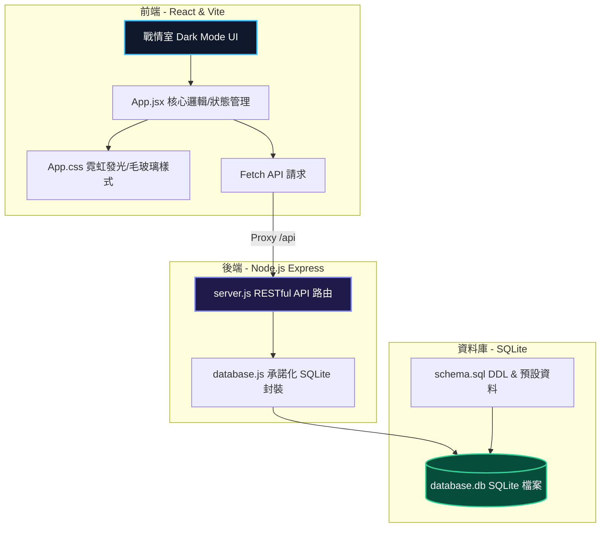

# Winbond MA21 EAP/EES 工程師面試前測驗 A
## 整合實作題：小型異常事件管理系統 (Fab 12 Anomaly Event Management)

本專案為應徵華邦電子 **MA21 EAP/EES 工程師** 之面試前實作題作品。系統設計靈感來自於半導體晶圓廠 (Fab) 的戰情監控中心與 EAP/EES 自動化系統架構，實現了異常事件的「即時統計、條件篩選、明細檢視與 SOP 狀態變更處置流轉工作流」。

---

## 🏗️ 系統架構簡述 (System Architecture)

本系統採用標準的 **前後端分離 (Decoupled) 與模組化分層架構**，具備高內聚、低耦合的特性，並透過代理伺服器 (Vite Proxy) 進行本機聯調：



### 關鍵設計特色：
1. **單一指令啟動**：透過根目錄的 `concurrently` 整合啟動，只需一個指令便能同時執行後端 Express API 與前端 Vite Dev Server，對使用者極度友善。
2. **前後端代理 (Proxy)**：前端透過 Vite 配置 `/api` 代理，避免跨域問題 (CORS) 並簡化部署與調試流程。
3. **Promise-based DB 封裝**：後端對非同步的 `sqlite3` 進行 Promise 封裝，全面使用現代 JavaScript 的 `async/await` 語法，提高程式碼可讀性與異常處理能力。

---

## 💾 資料表設計說明 (Database Design & DDL)

為了支援機台與事件的關聯性，系統設計了兩張核心資料表：
* **`machines` (機台資料表)**：記錄廠區內所有的生產與檢測設備。
* **`anomaly_events` (異常事件資料表)**：記錄機台發生的異常事件、嚴重程度、負責工程師與 SOP 處理狀態。

### Entity-Relationship 關係描述
* 一台 `machine` 可以擁有多個 `anomaly_event`（一對多關係）。
* `anomaly_events` 外鍵 `machine_id` 參考自 `machines` 的主鍵 `id`。

### 資料庫 DDL (schema.sql)
```sql
-- 機器資料表
CREATE TABLE IF NOT EXISTS machines (
    id TEXT PRIMARY KEY,
    name TEXT NOT NULL,
    type TEXT NOT NULL,
    location TEXT NOT NULL
);

-- 異常事件資料表
CREATE TABLE IF NOT EXISTS anomaly_events (
    id INTEGER PRIMARY KEY AUTOINCREMENT,
    event_code TEXT NOT NULL,
    machine_id TEXT NOT NULL,
    severity TEXT NOT NULL CHECK(severity IN ('Warning', 'Critical')),
    description TEXT NOT NULL,
    status TEXT NOT NULL CHECK(status IN ('Pending', 'Ack', 'Assign', 'Closed')) DEFAULT 'Pending',
    created_at DATETIME DEFAULT CURRENT_TIMESTAMP,
    updated_at DATETIME DEFAULT CURRENT_TIMESTAMP,
    operator_id TEXT,
    assigned_engineer TEXT,
    resolution TEXT,
    FOREIGN KEY(machine_id) REFERENCES machines(id)
);
```

---

## 🚀 快速啟動指南 (Quick Start)

請確認本機已安裝 **Node.js (建議 v18 以上，本開發測試環境為 v24.10.0)**。

### 步驟 1：下載並進入專案目錄
打開終端機 (PowerShell 或 Command Prompt) 進入本專案根目錄下。

### 步驟 2：一鍵安裝所有依賴
在專案根目錄執行以下指令，系統會自動安裝後端與前端的所有相依套件：
```bash
npm run install-all
```

### 步驟 3：啟動開發伺服器
執行以下指令，同時啟動後端 Express (連接 SQLite) 與前端 Vite 伺服器：
```bash
npm run dev
```

### 步驟 4：瀏覽體驗
打開瀏覽器，存取以下網址即可使用異常事件監控中心：
👉 **http://localhost:5173**

> [!NOTE]
> 後端 API 服務單獨運行於 `http://localhost:3001`，前端所有向 `/api/*` 發送的請求均會自動代理至後端。

---

## 🛠️ SOP 處置流程與狀態防呆驗證

本系統設計了嚴格的工廠 SOP 狀態機，防止人為誤操作：
* **Pending (待處理)** ➔ 點選「確認受理」轉為 **Ack**。或可點選「直接指派」、「快速關閉」進入表單。
* **Ack (已確認)** ➔ 強制要求填寫 **負責工程師**，送出後狀態轉為 **Assign**。
* **Assign (已指派)** ➔ 強制要求填寫 **處理對策與原因分析 (Resolution)**，提交後狀態轉為 **Closed**，並記錄最終解決方案。
* **Closed (已解決)** ➔ 異常單歸檔，頁面以綠色醒目卡片展示處置對策，不可再進行狀態變更。

---

## 🤖 AI 輔助開發宣告與個人判斷說明

本專案之開發過程中導入了 AI (Antigravity) 進行協作，以下如實申報 AI 使用方式及個人判斷改寫之處：

### 1. AI 用在哪些地方？
* **前端骨架與樣式調優**：請 AI 推薦符合半導體科技感（深色科技風、毛玻璃 HSL 漸層）的 CSS 變數配色與表格 Layout 結構，並優化了 Flex/Grid 的響應式排版。
* **SQLite Async 封裝**：AI 協助生成了將 callback-based 的 `sqlite3` 轉換為 Promise-based（`all`、`get`、`run`）的樣板程式碼。

### 2. 哪些部分是自己決定或重新改寫的？
* **根目錄 package.json 啟動鏈整合**：原本 AI 建議分別到 `backend/` 和 `frontend/` 下手動安裝並啟動，這不利於面試官開箱。我決定引入 `concurrently` 並在根目錄撰寫 `install-all` 與 `dev` 指令，將啟動體驗壓縮至最簡。
* **嚴格的狀態流轉表單防呆**：AI 一開始設計的更新狀態 API 允許空值（如無工程師也可 Assign）。我對後端 `server.js` 與前端 `App.jsx` 進行了雙重防呆改寫——在後端端點加上 `assigned_engineer` 及 `resolution` 的 `400 Bad Request` 驗證，並在前端輸入為空時禁用按鈕，提升系統的健壯性 (Robustness)。
* **SQLite 預設資料客製**：自己將預設機台與異常資料修改為 ASML 曝光機、Lam 蝕刻機等真實半導體廠會看見的機台編號（如 EXP-01, ETCH-02）及 OOC/OOS 異常情境，使其更貼合華邦電 EAP/EES 崗位的業務場景。

### 3. 如何驗證 AI 輸出的正確性？
* **API 邊界條件手動測試**：透過手動在瀏覽器操作，並故意透過 Postman / cURL 發送缺漏欄位的 `PUT` 狀態更新請求，驗證後端的 DDL CHECK 約束與 Express 的防呆阻斷邏輯是否確實生效。
* **SQLite 檔案數據驗證**：在進行狀態操作（如：Pendings ➔ Closed）後，透過 SQLite 檢視工具與 API 端點重刷，確認變更已持久化寫入 `database.db` 檔案，且 `updated_at` 時間戳記為最新本機時間。
